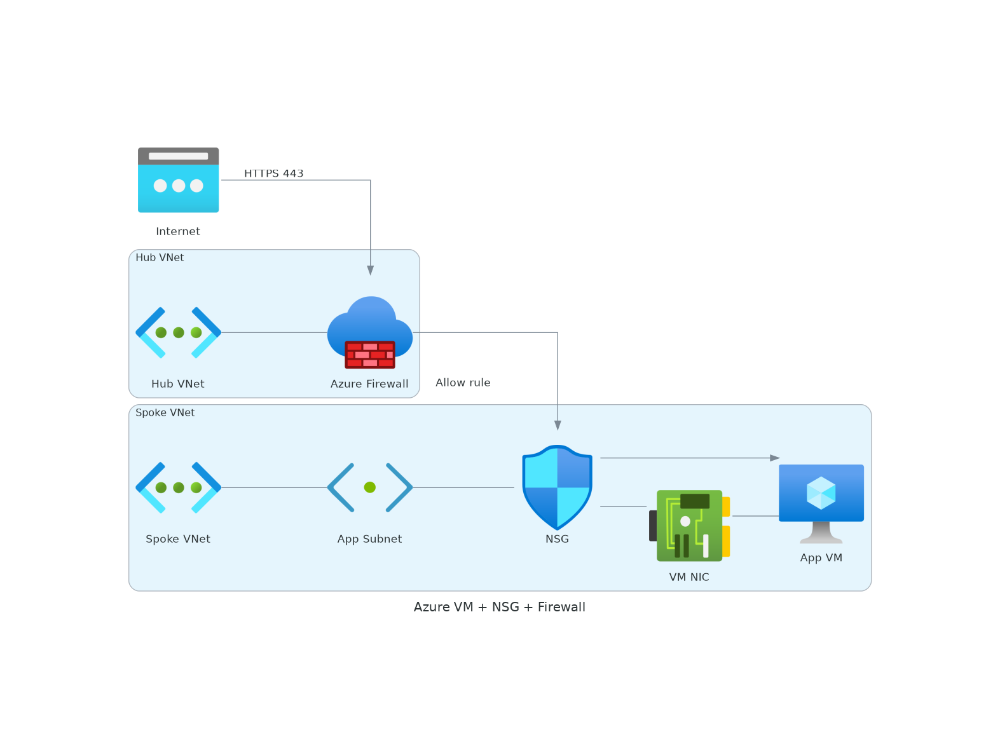

<!-- _class: title -->
<!-- _paginate: skip -->

# Sample Baseline Presentation

Skill Reference — All Slide Classes Demonstrated

<!--
Speaker notes: This is the canonical sample for the microsoft-presentation skill.
Every slide class and pattern used here is the expected baseline.
-->

---

## Agenda

- Title slide pattern
- Default (dark) content slide
- Divider slide pattern
- Light slide with diagram (optional add-on)
- Light slide with table
- Code example
- Lead (centered) slide
- Two-column layout
- Closing slide

---

## Key Highlights

Microsoft CES-FY26 Visual Identity applied:

- **Dark navy** `#091F2C` background with **white text**
- **Segoe UI** / **Segoe UI Semibold** fonts
- **Microsoft logo** rendered automatically via CSS
- **"Microsoft Confidential"** footer on every slide
- **Page numbers** in bottom-right corner

> This slide demonstrates the default (dark) class with bullets, bold, and blockquote.

---

<!-- _class: divider -->

## Section Break

<!--
Speaker notes: Divider slides use a slightly lighter navy (#0B2736)
with accent-blue heading. Use between major sections.
-->

---

<!-- _class: light -->

## Architecture Diagram (Optional Add-on)

Hub-and-spoke topology with Azure Firewall and NSG micro-segmentation.



<!--
Speaker notes: Diagram slides use the light class for best contrast.
Images reference diagrams/output/ with w:1100 center for consistent sizing.
This is an optional pattern — see diagrams.md for the full guide.
-->

---

<!-- _class: light -->

## Comparison Table

| Criteria | Option A | Option B |
|----------|----------|----------|
| **Scale** | Single instance | Auto-scaling |
| **Cost** | Lower | Higher |
| **Complexity** | Low | Medium |
| **Reliability** | Standard | High availability |

<!--
Speaker notes: Light slides work best for tables and dense data.
The gray logo variant switches automatically.
-->

---

## Code Example

Marp slides are defined in Markdown:

```markdown
---
marp: true
theme: microsoft-internal
paginate: true
footer: 'Microsoft Confidential'
---

<!-- _class: title -->

# Your Title Here
```

---

<!-- _class: lead -->

## Key Takeaway

The CES-FY26 Visual Identity provides
**consistent, professional branding** across all presentations.

---

<!-- _class: cols -->

## Benefits

- Consistent branding
- Dark professional look
- Auto logo + footer
- Self-contained output

## Trade-offs

- Fixed color palette
- Segoe UI required
- Limited to Marp syntax
- No custom animations

---

<!-- _class: title -->
<!-- _paginate: skip -->

# Thank You

Sample baseline — microsoft-presentation skill
