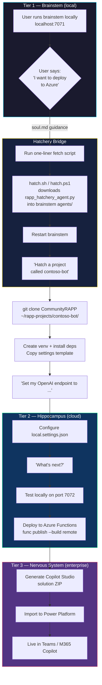

# RAPP Hippocampus

The memory center for your AI agents. Built on Azure Functions — local-first, deploy to Azure when ready.

## Create a Project

One command creates a ready-to-customize RAPP project on your machine. No global install — everything stays in its own folder.

**Mac / Linux:**
```bash
curl -fsSL https://raw.githubusercontent.com/kody-w/m365-agents-for-python/main/CommunityRAPP/hatch-project.sh | bash -s -- my-project
```

**Windows (PowerShell):**
```powershell
irm https://raw.githubusercontent.com/kody-w/m365-agents-for-python/main/CommunityRAPP/hatch-project.ps1 | iex
```

This creates `~/rapp-projects/my-project/` with everything you need:
- A Python virtual environment (isolated, won't touch your system)
- All dependencies installed
- Local file storage for memories (no cloud account needed)
- A start script to run it on your machine

**After it finishes:**
1. Run `cd ~/rapp-projects/my-project && ./start.sh` (Mac/Linux) or `.\start.ps1` (Windows)
2. Open http://localhost:7072/api/health to verify it's running
3. Add agents, customize the personality, test the memory system — all locally

Everything runs on your machine using local file storage. No Azure account, no API keys, no cloud services required to get started.

**For AI responses locally**, you have two options — both work without any Azure setup:

| Option | How | What you need |
|--------|-----|---------------|
| **GitHub Copilot** (recommended) | Set `GITHUB_TOKEN` env var or authenticate via the [Brainstem](https://github.com/kody-w/rapp-installer) | A GitHub account with Copilot access |
| **Azure OpenAI** | Fill in the Azure fields in `local.settings.json` | An Azure OpenAI resource |

If you already use the RAPP Brainstem, your GitHub auth is picked up automatically — no extra config.

**When you're ready for the cloud:**

| You want to... | Then... |
|----------------|---------|
| Deploy to Azure | Set Azure OpenAI credentials in `local.settings.json`, then `func publish` |
| Connect to Teams / M365 | Generate a Copilot Studio solution ZIP |

Each step is optional. You move forward only when you're ready — not before.

---

> In the brain, the **hippocampus** is responsible for forming and recalling memories. In the RAPP anatomy, it's the next evolution above the [Brainstem](https://github.com/kody-w/rapp-installer) — adding persistent memory, Azure Functions runtime, and cloud deployment.

```
  Brainstem (Tier 1)     →  Hippocampus (Tier 2)    →  Nervous System (Tier 3)
  Local Flask server        Azure Functions runtime     Copilot Studio + Teams
  GitHub Copilot LLM        Azure OpenAI                M365 Copilot
  Stateless agents          Persistent memory           Enterprise channels
```

> **IMPORTANT: This is an experimental research project, not an officially supported Microsoft product.**
>
> This tool is managed by a v-team within Microsoft and is provided as-is for the community. By using it you might sometimes experience unwanted patterns, errors, or unexpected behavior. By filing a [GitHub issue](https://github.com/kody-w/m365-agents-for-python/issues) you will help us improve this tool.
>
> **A few things to keep in mind:**
> - The Copilot Studio YAML schema may change without notice. Always review generated YAML before pushing to your environment.
> - AI-generated output may contain errors or unsupported patterns. Human review remains important.
> - Memory storage formats may evolve. Back up your `.local_storage/` or Azure File Share data before major upgrades.
> - This tool is evolving quickly. We're actively improving it based on feedback.

---

The Azure Function is the **hippocampus** — it forms and recalls memories on every request, hot-loads agents from the `agents/` folder, and routes requests via GPT function calling. Memories persist across conversations and restarts.

## Quick Start

### One-Liner Install (recommended)

**macOS / Linux:**
```bash
curl -fsSL https://raw.githubusercontent.com/kody-w/m365-agents-for-python/main/CommunityRAPP/install.sh | bash
```

**Windows (PowerShell — works on factory Windows 11):**
```powershell
irm https://raw.githubusercontent.com/kody-w/m365-agents-for-python/main/CommunityRAPP/install.ps1 | iex
```

Auto-installs Python 3.11, Node.js, Git, and Azure Functions Core Tools if missing. Walks you through Azure OpenAI configuration interactively.

Then:
```bash
communityrapp        # start the server → localhost:7071
communityrapp test   # send a test message
communityrapp status # check health
crapp                # short alias
```

### Manual Install

```bash
git clone https://github.com/kody-w/m365-agents-for-python.git
cd m365-agents-for-python/CommunityRAPP
cp local.settings.template.json local.settings.json
# Edit local.settings.json → add your Azure OpenAI key/endpoint
pip install -r requirements.txt
func start
```

Then open `index.html` in your browser for the chat UI — it connects to `localhost:7071` automatically.
```

> **Prerequisites:** Python 3.11, [Azure Functions Core Tools](https://learn.microsoft.com/en-us/azure/azure-functions/functions-run-local), an Azure OpenAI resource.

### Test It

```bash
# Say hello
curl -X POST http://localhost:7071/api/businessinsightbot_function \
  -H "Content-Type: application/json" \
  -d '{"user_input": "Hello!", "conversation_history": []}'

# Store a memory
curl -X POST http://localhost:7071/api/businessinsightbot_function \
  -H "Content-Type: application/json" \
  -d '{"user_input": "Remember that my favorite language is Python", "conversation_history": []}'

# Recall memories
curl -X POST http://localhost:7071/api/businessinsightbot_function \
  -H "Content-Type: application/json" \
  -d '{"user_input": "What do you know about me?", "conversation_history": []}'
```

## Architecture

```
┌─────────────────────────────────────────────┐
│        NERVOUS SYSTEM (Tier 3)              │
│  Teams · M365 Copilot · Copilot Studio      │
├─────────────────────────────────────────────┤
│        HIPPOCAMPUS (this repo)              │
│  Azure Function → GPT → Agent Dispatch      │
├─────────────────────────────────────────────┤
│        MEMORY AGENTS                        │
│  ContextMemory · ManageMemory · [yours]     │
├─────────────────────────────────────────────┤
│        LONG-TERM STORAGE                    │
│  Local (.local_storage/) or Azure Files     │
└─────────────────────────────────────────────┘
```

## How It Works

1. HTTP request hits `function_app.py`
2. Agents are loaded from the `agents/` folder (cached, auto-discovered)
3. Memory is initialized — shared context + user-specific context (by GUID)
4. Azure OpenAI is called with function definitions built from agent metadata
5. GPT selects which agent to call → agent executes → response returned

## Memory System

| Aspect | Detail |
|--------|--------|
| **Layers** | Shared (all users) + user-specific (per GUID) |
| **Storage** | Local files (`.local_storage/`, default) or Azure File Storage |
| **Memory types** | `fact`, `preference`, `insight`, `task` |
| **Persistence** | Survives across conversations and restarts |

Send a `user_guid` in the request body to scope memories to a specific user. Without one, a default shared context is used.

## API Reference

### `GET /api/health`

Health check. Anonymous auth. Returns component status for OpenAI, agents, and storage.

### `POST /api/businessinsightbot_function`

Main conversation endpoint. Requires a function key (or runs anonymously locally).

**Request:**

```json
{
  "user_input": "What do you know about me?",
  "conversation_history": [],
  "user_guid": "optional-user-guid"
}
```

**Response:**

```json
{
  "assistant_response": "Based on my memory, ...",
  "voice_response": "Short summary for TTS.",
  "agent_logs": "ContextMemory called with ...",
  "user_guid": "c0p110t0-aaaa-bbbb-cccc-123456789abc"
}
```

### `POST /api/trigger/copilot-studio`

Direct agent invocation for Copilot Studio / Power Automate flows. Requires a function key.

**Request:**

```json
{
  "agent": "ContextMemory",
  "action": "recall_context",
  "parameters": {
    "full_recall": true,
    "user_guid": "optional-user-guid"
  }
}
```

**Response:**

```json
{
  "status": "success",
  "response": "• User prefers dark mode (Theme: preference, Recorded: 2026-03-13)",
  "copilot_studio_format": {
    "type": "event",
    "name": "agent.response",
    "value": { "success": true, "message": "..." }
  }
}
```

## Adding Custom Agents

Create a file in `agents/`:

```python
from agents.basic_agent import BasicAgent

class MyAgent(BasicAgent):
    def __init__(self):
        self.name = 'MyAgent'
        self.metadata = {
            "name": self.name,
            "description": "What this agent does",
            "parameters": {
                "type": "object",
                "properties": {
                    "input": {
                        "type": "string",
                        "description": "Input parameter"
                    }
                },
                "required": ["input"]
            }
        }
        super().__init__(self.name, self.metadata)

    def perform(self, **kwargs):
        input_data = kwargs.get('input', '')
        return f"Processed: {input_data}"
```

Drop the file in `agents/`, restart — it's auto-discovered.

## Ready for the Cloud? (Hatchery)

If you're running the [RAPP Brainstem](https://github.com/kody-w/rapp-installer) locally and want to deploy to Azure for a customer, the **Hatchery** bridges the gap.



**Install the hatchery:**

**macOS / Linux:**
```bash
curl -fsSL https://raw.githubusercontent.com/kody-w/m365-agents-for-python/main/CommunityRAPP/hatch.sh | bash
```

**Windows:**
```powershell
irm https://raw.githubusercontent.com/kody-w/m365-agents-for-python/main/CommunityRAPP/hatch.ps1 | iex
```

Each project gets its own directory, venv, and port. The brainstem continues running as your local AI.

> **Principle:** Start small, layer up when ready. See [CONSTITUTION.md](CONSTITUTION.md) Article XIII.

## Deploy to Azure

See the deploy skill at [`.github/copilot/skills/deploy-to-azure.md`](.github/copilot/skills/deploy-to-azure.md) for full instructions.

Quick version:

```bash
# Ensure storage has public network access (required for Flex Consumption)
az storage account update --name $STORAGE --resource-group $RG --public-network-access Enabled

# Deploy with remote build (critical — local build ships wrong binaries)
func azure functionapp publish $FUNC_APP --build remote
```

ARM template: [`azuredeploy.json`](azuredeploy.json)

## Deploy to Copilot Studio

Generate a Power Platform solution package and import it:

```bash
python utils/generate_memory_agent_solution.py
# Outputs a .zip solution file

# Import via Power Platform CLI
pac solution import --path ./output/MemoryAgent_solution.zip
```

This creates a Copilot Studio bot wired to your Azure Function endpoint.

## Project Structure

```
CommunityRAPP/
├── function_app.py              # Azure Function entry point (the "hippocampus")
├── index.html                   # Standalone chat UI (open in browser, no server needed)
├── agents/
│   ├── basic_agent.py           # Base agent class
│   ├── context_memory_agent.py  # Memory recall agent
│   └── manage_memory_agent.py   # Memory storage agent
├── utils/
│   ├── storage_factory.py       # Storage backend selector
│   ├── azure_file_storage.py    # Azure File Storage backend
│   ├── local_file_storage.py    # Local file storage backend
│   ├── environment.py           # Environment detection
│   ├── result.py                # Functional error types (Result/Success/Failure)
│   └── generate_memory_agent_solution.py  # Copilot Studio solution generator
├── tests/
│   └── test_memory_agents.py    # 34 unit + integration tests
├── install.sh                   # One-liner installer (macOS/Linux)
├── install.ps1                  # One-liner installer (Windows)
├── .github/copilot/skills/
│   └── deploy-to-azure.md       # Deploy skill for Copilot
├── azuredeploy.json             # ARM template
├── requirements.txt             # Python dependencies (24 packages)
├── host.json                    # Azure Functions config
└── local.settings.template.json # Config template (copy to local.settings.json)
```

## Running Tests

```bash
python -m unittest tests.test_memory_agents -v
```

Tests are mocked — no API keys or Azure resources required.

## Configuration

All settings go in `local.settings.json` (never committed). Copy from the template:

| Variable | Required | Description |
|----------|----------|-------------|
| `AZURE_OPENAI_API_KEY` | Yes | Azure OpenAI API key |
| `AZURE_OPENAI_ENDPOINT` | Yes | Azure OpenAI endpoint URL |
| `AZURE_OPENAI_DEPLOYMENT_NAME` | Yes | Model deployment name (e.g. `gpt-4o`) |
| `AZURE_OPENAI_API_VERSION` | Yes | API version (e.g. `2024-08-01-preview`) |
| `AzureWebJobsStorage` | Yes | Storage connection string (or `UseDevelopmentStorage=true`) |
| `USE_CLOUD_STORAGE` | No | `true` for Azure Files, `false` for local (default: `false`) |
| `ASSISTANT_NAME` | No | Bot display name |
| `CHARACTERISTIC_DESCRIPTION` | No | System prompt personality description |

## Disclaimer

This project is an experimental research project, not an officially supported Microsoft product. The Copilot Studio YAML schema may change without notice. Always review and validate generated YAML before pushing to your environment — AI-generated output may contain errors or unsupported patterns.

If you've used this tool, opened an issue, or simply have spent some time with it and have feedback, we'd love to hear from you. File a [GitHub issue](https://github.com/kody-w/m365-agents-for-python/issues) or reach out on LinkedIn. We're actively listening and improving based on community feedback.

## Contributing

See [CONTRIBUTING.md](CONTRIBUTING.md) for guidelines. In short:

1. Fork the repo
2. Create a feature branch
3. Make your changes (add tests if adding agents)
4. Run tests: `python -m unittest tests.test_memory_agents -v`
5. Submit a PR

## License

[MIT](LICENSE)
