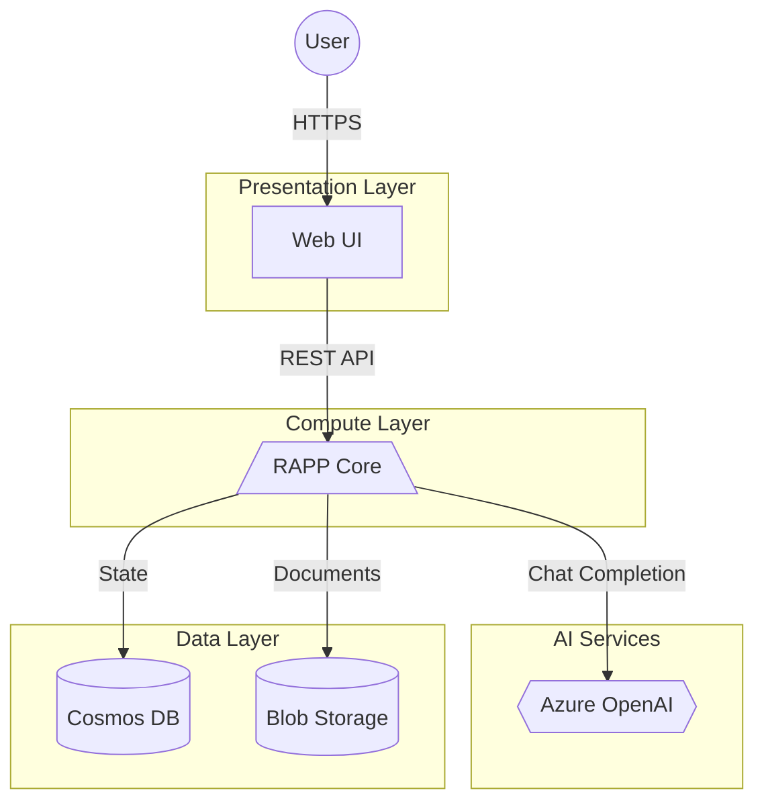

# RAPP Platform Architecture

```mermaid
flowchart TB
    %% RAPP Platform Architecture

    subgraph presentation[Presentation Layer]
        webapp[Web UI]
    end

    subgraph compute[Compute Layer]
        func[/RAPP Core\]
    end

    subgraph ai[AI Services]
        openai{{Azure OpenAI}}
    end

    subgraph data[Data Layer]
        cosmos[(Cosmos DB)]
        blob[(Blob Storage)]
    end

    user((User))

    user -->|HTTPS| webapp
    webapp -->|REST API| func
    func -->|Chat Completion| openai
    func -->|State| cosmos
    func -->|Documents| blob
```